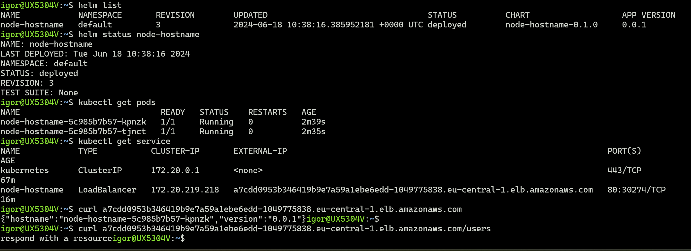

# Docker

[Dockerfile](./Dockerfile) to create a containerized application

# Helm

I used Helm to deploy the application.

Helm [chart](./helm) with templates for [deployment](./helm/templates/deployment.yaml) and [service](./helm/templates/service.yaml)

# Infrastructure

Deployment is carried out on an AWS EKS cluster.
EKS cluster provisioned by [Terraform](./terraform)

# CI/CD

CI and CD processes implemented on Github Actions

[workflow manifest](./.github/workflows/builddeploy.yml)

successful deployment can be viewed [here](https://github.com/igorkar/node-hostname/actions/runs/9563536476)

# Checks

Unfortunately I do not have a permanently deployed infrastructure and I can't provide a public link to the app

But there is a screenshot to confirm that the application worked correctly

